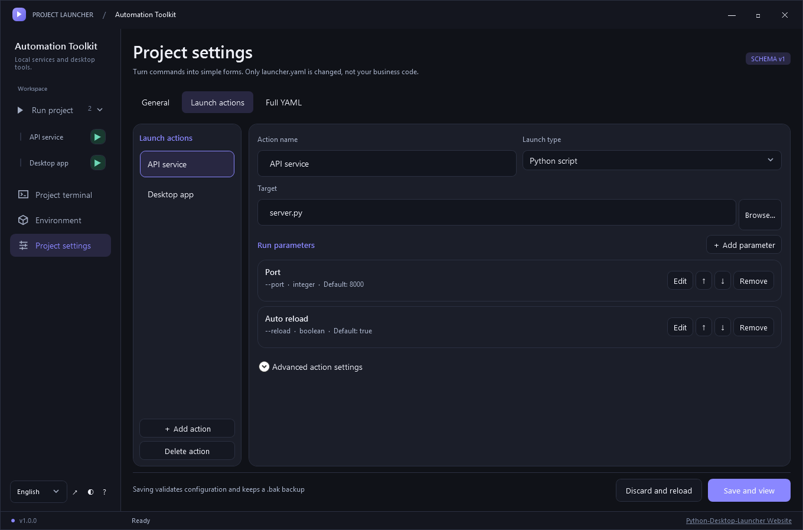

# Python Desktop Launcher

[English](README.md) | [简体中文](README.zh-CN.md)

**One Python project. One desktop launcher. Multiple launch actions.**

Turn project commands into forms. Copy `Launcher.exe` into your Python project, bind its environment, and configure actions and parameters—without changing business code.

Windows x64 / x86 · Native C# / WPF · Chinese / English · MIT · **v1.0.0**



*Actual native WPF rendering from an isolated example project—not a web mockup.*

## Why use it?

- **Your own environment:** detect and bind a virtual environment; no launcher UI dependencies in your business `.venv`.
- **Action-specific forms:** separate service, app and script actions, each with parameters and presets.
- **Visible execution:** command preview, live logs, exit status, history and confirmed stop controls.
- **Real terminals:** persistent PowerShell, CMD and Python sessions in the project environment.
- **Live language switching:** Chinese / English without losing drafts or restarting jobs and terminals.

One project per launcher. Currently **one GUI job at a time**, with multiple terminal sessions. Not an IDE, sandbox or global project dashboard.

## Quick start

### 1. Get Launcher.exe

Download the **EXE** for your Windows architecture—no extraction or installation required:

- [Download v1.0.0 for Windows x64](https://github.com/JonGates/Python-Desktop-Launcher/releases/download/v1.0.0/Launcher-v1.0.0-win-x64.exe) — recommended for 64-bit Windows.
- [Download v1.0.0 for Windows x86](https://github.com/JonGates/Python-Desktop-Launcher/releases/download/v1.0.0/Launcher-v1.0.0-win-x86.exe) — for 32-bit Windows.

Place it in your project directory. You may rename it to `Launcher.exe` to match the examples below. The launcher is self-contained; the project still needs its own Python environment.

The [release page](https://github.com/JonGates/Python-Desktop-Launcher/releases/tag/v1.0.0) also offers optional ZIP packages with licenses. Retain the relevant licenses when redistributing. For source builds, see [Windows build instructions](docs/BUILD_WINDOWS.md).

### 2. Copy it into your project

```text
my-project/
├── Launcher.exe       ← copy here
├── .venv/             ← your project's environment
├── server.py
└── requirements.txt
```

Do not copy this repository's environment, demo files or old launcher runtime. Preserve the supplied licenses when redistributing the launcher.

### 3. Bind the environment

Double-click `Launcher.exe`.

- Existing `launcher.yaml` / `Launcher.yaml`: loads directly.
- No configuration: confirm the project directory, select the detected environment, then bind and create configuration.
- No environment: bind first, then use **Environment** to explicitly initialize one and install dependencies.

No entry file is required during binding. Detection does not execute project code. Missing environments never silently fall back to system Python.

### 4. Add an action and parameters

Open **Project settings → Launch actions → Add action**.

For a script that supports `python server.py --port 8000`:

| Setting | Value |
|---|---|
| Action name | API service |
| Launch type | Python script |
| Target | server.py |
| Add parameter → Name | Port |
| Command argument | --port |
| Type / Default | integer / 8000 |

Add and edit parameters in the dialog. Each action owns its parameters. Options must match your script; the launcher does not invent CLI options or automatically parse arbitrary Python code.

Click **Save and view** to see the action's parameter form immediately.

### 5. Run

Select an action under **Run project**, adjust its values and click **Start action**. The sidebar's green triangle also starts it; the red stop circle asks for confirmation before terminating the job.

Configuration trust and dependency changes require confirmation. Errors use dismissible overlay notifications without pushing the editor down.

## Go EXE and Java JAR examples

**Current limitation: both examples still require a bound Python virtual environment.** They use existing launch actions, not dedicated Go/Java runtime modes. Prepare the business EXE/JAR and its dependencies separately. The filenames and CLI options below illustrate programs that actually accept these options; adapt them to your application.

### Go: launch an already-built EXE

Suppose your Go program is packaged as `bin/report.exe` and accepts:

```text
./bin/report.exe --input "D:\data\sales report.csv" --workers 4
```

In **Project settings → Launch actions → Add action**, enter:

| Setting | Value |
|---|---|
| Action name | Go report |
| Launch type | Other program |
| Target | ./bin/report.exe |
| Input parameter | Name: Input file; type: file; binding: argument; command argument: --input; required; must exist |
| Workers parameter | Name: Workers; type: integer; binding: argument; command argument: --workers; default: 4; min: 1; max: 32 |

Click **Save and view**, choose the input file, adjust workers, inspect the command preview and start the action. The launcher executes the packaged EXE directly; it does not run `go build` or require the Go compiler for this action. Preserve any resources/native libraries the program needs. A file path containing spaces remains one argument; do not add literal quotes in the target field or file input.

### Java: launch an already-built JAR

Suppose `dist/service.jar` has a runnable entry point and accepts `--port 8080`. Java must already be available. Choose **Advanced command** and replace the fixed command with these five lines (one argument per line):

```text
java
-Xmx512m
-Dapp.mode=prod
-jar
./dist/service.jar
```

Add a **Port** parameter: type `integer`, binding `argument`, command argument `--port`, default `8080`, min `1`, max `65535`. After **Save and view**, changing the port to `9090` produces:

```text
java -Xmx512m -Dapp.mode=prod -jar ./dist/service.jar --port 9090
```

Keep JVM options (`-Xmx...`, `-D...`) **before `-jar`** in the fixed command; the form appends application arguments after the JAR. If Java is not on the child process PATH, replace the first line with the real full path to `java.exe`, without surrounding quotes in the editor. A JAR is not an EXE and cannot be selected directly as Other program.

### YAML equivalent for both actions

The following is a complete configuration example. Put it beside `Launcher.exe`, with a real `.venv`, `bin/report.exe` and `dist/service.jar` under the same project root. Review/merge it in settings if you already have a configuration; do not overwrite it blindly. No business binaries are included with this example.

```yaml
schema_version: 1
app:
  name: Packaged tools
runtime:
  mode: existing
  project_dir: .
  venv: .venv
  requirements: ''
actions:
  - id: go_report
    label: Go report
    argv: ['./bin/report.exe']
    parameters: [input, workers]
  - id: java_service
    label: Java service
    argv: [java, -Xmx512m, '-Dapp.mode=prod', -jar, './dist/service.jar']
    parameters: [port]
parameters:
  - name: input
    label: Input file
    type: file
    argument: --input
    required: true
    must_exist: true
  - name: workers
    label: Workers
    type: integer
    argument: --workers
    default: 4
    min: 1
    max: 32
  - name: port
    label: Port
    type: integer
    argument: --port
    default: 8080
    min: 1
    max: 65535
```

The fixed `argv` selects the program and its fixed options; action `parameters` lists select which form fields to append, in order. `name` is an internal reference; `argument` is the actual CLI option. Do not put the same editable option in both places. All actions run in `runtime.project_dir`, not automatically beside the executable. These examples use separate option/value tokens; for applications requiring `--port=8080`, see the [detailed configuration guide](docs/LAUNCH_ACTIONS.md).

## Generate configuration with AI

The included [generate-launcher-config skill](skills/generate-launcher-config/SKILL.md) reads your Python project's entry points, CLI definitions and environment to generate `launcher.yaml`. Its bundled schema reference works independently of this repository.

Give your AI assistant the skill path and target project (replace these example paths):

```text
Read D:/tools/Python-Desktop-Launcher/skills/generate-launcher-config/SKILL.md.
Use it to generate launcher.yaml for D:/projects/my-python-app.
Find the actual entry points and parameters, and explain their source locations.
Validate with Launcher.Cli.exe check if available.
Do not run business code or initialize/install dependencies.
```

For repeated use, copy the entire `skills/generate-launcher-config` folder into your AI tool's skills directory. Current [Codex skill documentation](https://learn.chatgpt.com/docs/build-skills#where-codex-loads-local-skills) lists `~/.agents/skills` for personal use and `<target-project>/.agents/skills` for project use. If your installed version uses another skills location, use that configured location. Once the skill is available, invoke:

```text
Use $generate-launcher-config to generate and validate launcher.yaml for this Python project.
```

The skill checks for concurrent edits and backs up before replacing existing configuration. Unknown entry points require clarification or an environment-only configuration with no actions. If launcher validation is unavailable, it reports that limitation and leaves existing configuration untouched, producing a candidate for review.

Review the result in **Project settings**, inspect the **command preview**, then explicitly start an action. Configuration validation does not prove dependency readiness; environment initialization/synchronization remains a separate confirmed action. See [configuration rules](docs/CONFIG.md).

## FAQ

**Do I need a python.exe path for each command or package installation?**

No. Python-script and Python-module actions use the bound interpreter. In the project terminal, prefer `python -m pip install <package>`. The environment must contain pip; some uv environments do not. Bare `pip` may resolve elsewhere on PATH. See [integration and environments](docs/INTEGRATION.md).

**Where is the language setting?**

Bottom left. First launch follows the system (Chinese → Chinese; otherwise English), then remembers your choice in `%LOCALAPPDATA%/ProjectLauncher/preferences.json`. Project names, parameter values, business logs and terminal output remain unchanged.

**Will saving overwrite my code?**

Settings write `launcher.yaml`, validate first, keep a `.bak` and reject stale disk changes. Settings do not rewrite business code or dependency files. Stop jobs and terminal sessions before applying changed configuration. YAML comments/formatting may be normalized.

**Is the terminal a sandbox?**

No. Explicit commands can leave the project environment. Use the system-terminal option for complex full-screen TUI programs. Do not put secrets in configuration defaults. See [security boundaries](docs/SECURITY.md).

**Is this production-ready?**

v1.0.0 binaries are unsigned. Native builds and automated tests have been run; manual DPI, IME, clean-machine and full business-workflow acceptance remain outstanding. See [exact verification scope](docs/TESTING.md).

## Learn more & contribute

- [Configuration](docs/CONFIG.md) · [Integration](docs/INTEGRATION.md)
- [Development](docs/DEVELOPMENT.md) · [Testing](docs/TESTING.md)
- [Report a bug or suggest a feature](https://github.com/JonGates/Python-Desktop-Launcher/issues)
- [License](LICENSE) · [Third-party notices](THIRD_PARTY_NOTICES.md)

Include Windows version, launcher version, reproduction steps and sanitized configuration in bug reports. Never upload secrets or private business logs.
