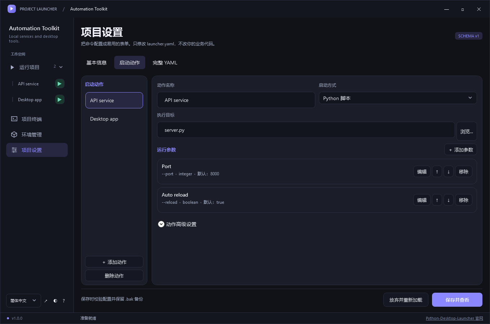

# Python Desktop Launcher

[English](README.md) | [简体中文](README.zh-CN.md)

**一个 Python 项目，一个桌面启动器，多个启动动作。**

把项目命令变成易用的表单：将 `Launcher.exe` 复制到 Python 项目，绑定项目环境，配置动作和参数，无需改动业务代码。

Windows x64 / x86 · 原生 C# / WPF · 中英文 · MIT · **v1.0.0**



*隔离示例项目的真实原生 WPF 渲染，不是网页效果图。*

## 为什么使用它？

- **沿用项目环境：** 检测并绑定虚拟环境，不向业务 `.venv` 安装启动器界面依赖。
- **每个动作独立配置：** 服务、应用、脚本各自拥有参数表单和预设。
- **看清运行情况：** 命令预览、实时日志、退出状态、历史，以及需要确认的停止操作。
- **真正的终端：** 项目环境中的持续 PowerShell、CMD 和 Python 会话。
- **即时语言切换：** 中英文切换不丢草稿，不重启任务或终端。

一个启动器管理一个项目。目前**同时运行一个 GUI 任务**，可以打开多个终端会话。不是 IDE、沙箱或全局项目管理平台。

## 快速使用

### 1. 获取 Launcher.exe

到 [Releases](https://github.com/JonGates/Python-Desktop-Launcher/releases) 下载 **portable ZIP**。64 位 Windows 选择 **win-x64**（推荐），32 位 Windows 选择 **win-x86**。解压并保留随附许可证。

也可以在 Windows 上使用 **.NET 10 SDK** 从源码构建：

```powershell
git clone https://github.com/JonGates/Python-Desktop-Launcher.git
cd Python-Desktop-Launcher
.\Build.cmd
```

输出：`artifacts/portable/Launcher.exe`。这是自包含单文件构建，业务项目仍需自己的 Python 环境。[构建详情](docs/BUILD_WINDOWS.md)。

### 2. 复制到项目

```text
my-project/
├── Launcher.exe       ← 复制到这里
├── .venv/             ← 项目自己的环境
├── server.py
└── requirements.txt
```

不要复制本仓库的环境、Demo 文件或旧启动器 runtime。重新分发时请保留随附许可证。

### 3. 绑定环境

双击 `Launcher.exe`。

- 已有 `launcher.yaml` / `Launcher.yaml`：直接读取使用。
- 没有配置：确认项目目录，选择检测到的环境，绑定并生成配置。
- 没有环境：可以先绑定，再进入「环境管理」，明确确认后创建环境、安装依赖。

首次绑定无需填写入口文件。检测不执行项目代码；缺少环境时不会静默回退系统 Python。

### 4. 添加动作和参数

进入「项目设置 → 启动动作 → 添加动作」。

以支持 `python server.py --port 8000` 的脚本为例：

| 设置 | 填写内容 |
|---|---|
| 动作名称 | API 服务 |
| 启动方式 | Python 脚本 |
| 执行目标 | server.py |
| 添加参数 → 参数名称 | 端口 |
| 命令参数 | --port |
| 控件类型 / 默认值 | integer / 8000 |

在弹窗中新增、编辑参数，每个动作拥有自己的参数。选项必须是脚本实际支持的，启动器不会凭空增加 CLI 能力，也不会自动解析任意 Python 代码。

点击「保存并查看」，立即看到该动作的参数表单。

### 5. 运行

展开「运行项目」，选择动作、调整参数，点击「启动动作」。侧栏绿色三角也可以开始运行；红色停止圆圈会在确认后终止任务。

配置信任与依赖修改需要确认。错误使用可关闭的悬浮通知，不会把编辑区挤下去。

## 使用 AI 生成启动配置

仓库提供 [generate-launcher-config skill](skills/generate-launcher-config/SKILL.md)：让 AI 根据 Python 项目的真实入口、命令行参数和环境生成 `launcher.yaml`。配置规范随 skill 一起提供，复制整个目录后可独立使用。

无需安装，也可直接给 AI 以下指令（把示例路径替换为实际路径）：

```text
读取 D:/tools/Python-Desktop-Launcher/skills/generate-launcher-config/SKILL.md，
按该 skill 为 D:/projects/my-python-app 生成 launcher.yaml。
从真实代码和文档确认启动入口、参数及其来源。
如果有 Launcher.Cli.exe，使用 check 验证配置。
不要运行业务代码，不要初始化环境或安装依赖。
```

经常使用时，将整个 `skills/generate-launcher-config` 文件夹复制到 AI 工具的 skills 目录。[Codex 当前文档](https://learn.chatgpt.com/docs/build-skills#where-codex-loads-local-skills)列出的个人目录为 `~/.agents/skills`，项目目录为 `<目标项目>/.agents/skills`；如果已安装版本使用其他 skills 位置，请按该版本的配置放置。发现该 skill 后输入：

```text
使用 $generate-launcher-config 为当前 Python 项目生成并验证 launcher.yaml。
```

skill 会检查已有配置是否被外部修改，并在替换前备份。入口不明确时，会询问实际启动命令，或只生成不含动作的环境绑定配置。无法运行启动器校验时会明确说明，并保留已有配置，另存候选文件供检查。

生成后，在**项目设置**中核对配置，在运行页查看**命令预览**，再主动启动动作。配置校验不代表业务依赖已就绪；初始化环境、同步依赖仍需单独确认。字段详情见[配置规范](docs/CONFIG.md)。

## 常见问题

**每次运行或安装库，都要填写 python.exe 吗？**

不用。Python 脚本和模块动作使用绑定的解释器。在项目终端优先使用 `python -m pip install <库名>`。环境本身必须包含 pip，某些 uv 环境不自带 pip；直接输入 `pip` 可能沿 PATH 找到其他环境。详见 [环境与接入说明](docs/INTEGRATION.md)。

**在哪里切换语言？**

左下角选择语言。首次跟随系统（中文系统使用中文，其余使用英文），之后记住选择，保存在 `%LOCALAPPDATA%/ProjectLauncher/preferences.json`。项目名称、参数值、业务日志和终端输出保持原文。

**保存设置会覆盖业务代码吗？**

设置写入 `launcher.yaml`，保存前校验、保留 `.bak`，检测到磁盘变化时拒绝覆盖。设置页不改写业务代码和依赖文件。应用配置修改前需结束任务和终端；YAML 注释和排版可能被规范化。

**终端是沙箱吗？**

不是。显式命令仍可离开项目环境。复杂全屏 TUI 可使用系统终端。不要把密钥写入配置默认值，详见 [安全边界](docs/SECURITY.md)。

**现在是正式稳定版吗？**

v1.0.0 程序未签名。已进行原生构建和自动测试，人工 DPI、IME、干净机器与完整业务流程验收尚未完成。详见 [准确的验证范围](docs/TESTING.md)。

## 更多文档与参与贡献

- [配置规范](docs/CONFIG.md) · [接入说明](docs/INTEGRATION.md)
- [二开指南](docs/DEVELOPMENT.md) · [测试与验收](docs/TESTING.md)
- [反馈问题或建议](https://github.com/JonGates/Python-Desktop-Launcher/issues)
- [许可证](LICENSE) · [第三方说明](THIRD_PARTY_NOTICES.md)

反馈时请附 Windows 版本、启动器版本、复现步骤与脱敏配置，不要上传密钥或私有业务日志。
